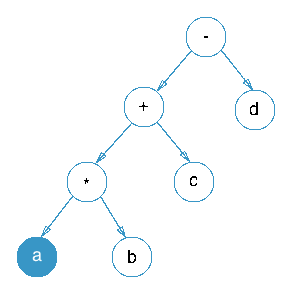

### Definition of an Infix Expression

The operator is present between the operands on which it is acted upon.
It is also the expression obtained from inorder travesal of an expression tree.

   - ( A + B ) * C
   - 1 + 2 * 4 + 5 / 2 - 1

### Definition of an Infix Expression Example

