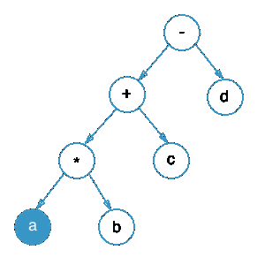

### Definition of a Postfix Expression (RPN)

The operator is present after the operands that it is acted upon.  
It is also the expression obtained from postorder travesal of an expression tree.  
It is also called the Reverse Polish Notation (RPN). 

   - 2 3 + (RPN of 2 + 3)
   - A B + C * (RPN of ( A + B ) * C)

### Definition of a Postfix Expression Example

 

 
