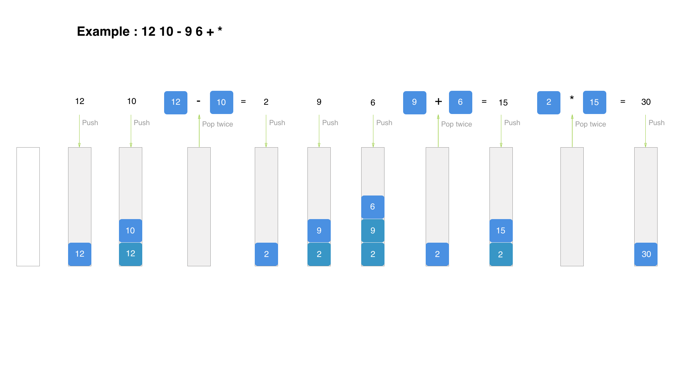

### Algorithm for Postfix Evaluation

1. Create an empty stack called operandStack.
2. Scan the string from left to right.
   - If the token is an operand, convert it from a string to an integer and push the value onto the operand stack.
   - If the token is an operator, *, /, +, or -, it will need two operands. Pop the operandStack twice. The first pop is the second operand and the second pop is the first operand. Perform the arithmetic operation. Push the result back on the operand stack.
3. When the input expression has been completely processed, the result is on the stack. Pop the operand stack and return the value.

### Postfix Evaluation Example

 

