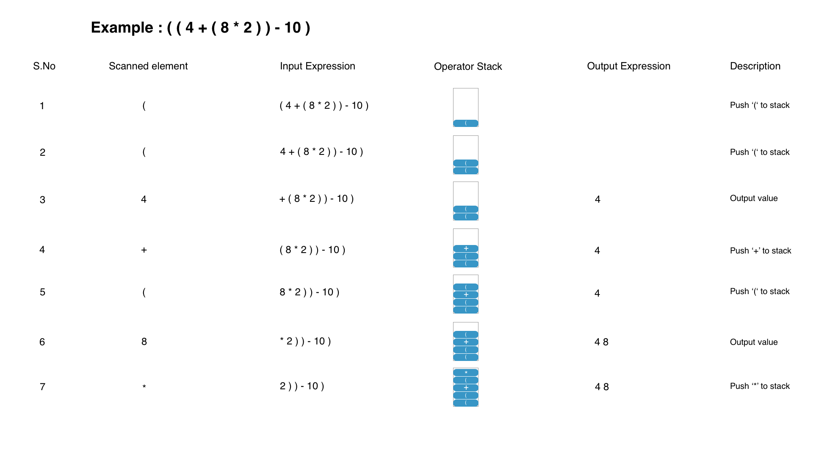
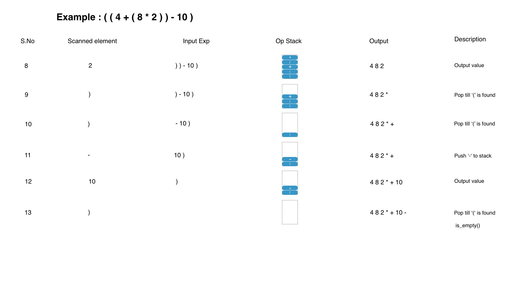

### Algorithm for Push Operations on Stack

**Algorithm :**

   - Parenthesize and validate the given expression using operator precedence.
   - Opening brackets and operators can be pushed into the stack.
   - Numbers/ Operators can be moved to the output.

### Push operations Example

### Algorithm for Pop Operations on Stack

The following are the scenarios where the pop operation is used:

   - If it is an operator, and none of the situations match for the Push of the Operator  
     - then Pop the operator and go to the next element.
   - If it is a closing parenthesis, pop operators from the stack and output them until an opening parenthesis is encountered. Pop and discard the opening parenthesis.
   - If there is no more input, pop the remaining operators to output.

### Pop Operations Example

