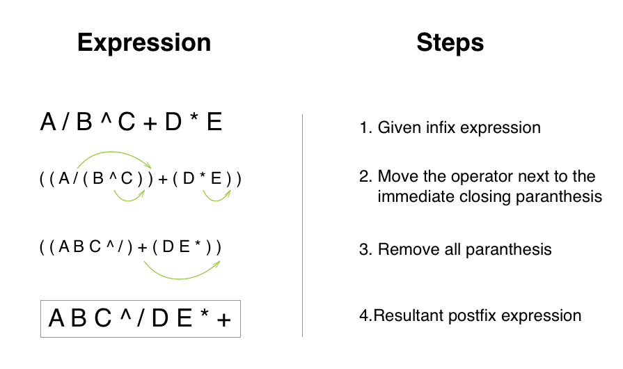

### Conversion without Stack

**Algorithm:**

   - Parenthesize the expression following operator precedence.
   - Priority(^) > Priority(/) > Priority(*) > Priority(+) >= Priority(-)
   - Starting from the lowest level in the parenthesized expression,
   - Rearrange the expression to RPN as (3 + 4) becomes (3 4 + ).
   - Go to subsequent upper levels.
   - Thereby, convert the whole expression to RPN.

### Conversion without Stack Example

